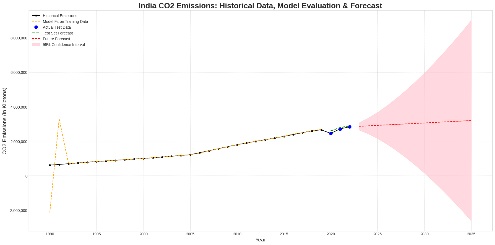

# India CO2 Emissions Forecasting Project 🇮🇳📈

## Overview

This project provides a comprehensive forecast of India's CO2 emissions until 2035. It uses a SARIMAX (Seasonal AutoRegressive Integrated Moving Average with eXogenous factors) time-series model, which incorporates key economic indicators—GDP and Population—to generate a robust and statistically sound prediction.

The entire data science workflow is implemented, from data preprocessing and hyperparameter tuning to model evaluation and visualization.

---

## 🚀 Features

* **Advanced Time-Series Modeling**: Utilizes a powerful `SARIMAX` model.
* **Multivariate Analysis**: Incorporates GDP and Population as external factors (exogenous variables) for a more accurate forecast.
* **Automated Hyperparameter Tuning**: Programmatically finds the optimal model order `(p, d, q)` using a grid search based on the Akaike Information Criterion (AIC).
* **Rigorous Evaluation**: Splits data into training and test sets and evaluates model performance using Root Mean Squared Error (RMSE).
* **Model Diagnostics**: Generates diagnostic plots to validate the model's assumptions and ensure its reliability.
* **Professional Visualization**: Creates a clear and informative plot showing historical data, model fit, test set validation, and the final forecast with 95% confidence intervals.

---

## 📊 Results

The final forecast shows the predicted trajectory of CO2 emissions along with the confidence interval, providing a data-driven outlook.



---

## 🛠️ How to Run

1.  **Clone the repository:**
    ```bash
    git clone [https://github.com/your-username/your-repo-name.git](https://github.com/your-username/your-repo-name.git)
    cd your-repo-name
    ```

2.  **Create a virtual environment (recommended):**
    ```bash
    python -m venv venv
    source venv/bin/activate  # On Windows, use `venv\Scripts\activate`
    ```

3.  **Install the required libraries:**
    ```bash
    pip install -r requirements.txt
    ```

4.  **Run the script:**
    ```bash
    python forecast_co2.py
    ```
